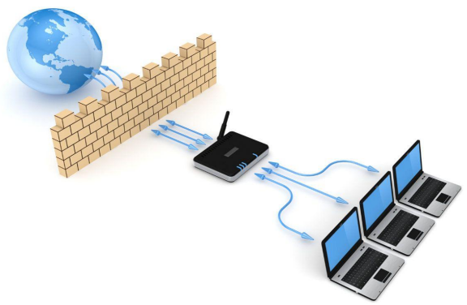

# Wildcard-Masks-in-ACLs

__ACLs__: __"Access Control Lists"__ are configurations implemented on networking devices like routers or firewalls. They're used to manage and regulate the flow of traffic entering or exiting a network based on specific criteria. These criteria could include factors such as IP addresses, protocols, or ports. ACLs are typically applied to specific network interfaces on networking devices and can be configured to manage both inbound and outbound traffic flows. They serve as critical tools for __enforcing security policies__ and __access controls__ within a network environment, enabling administrators to regulate traffic effectively and maintain __network integrity__.

### ACLs can be categorized into two primary types:

__Standard Access Control Lists (Standard ACLs)__: These ACLs primarily focus on the source IP address of the traffic. They're capable of permitting or denying traffic based solely on the source IP address.

__Extended Access Control Lists (Extended ACLs)__: In contrast, Extended ACLs offer a broader range of criteria for filtering. They can specify various parameters such as source and destination IP addresses, protocols, ports, and more, providing more detailed control over traffic.

https://community.cisco.com/t5/networking-knowledge-base/cisco-access-control-lists-acl/ta-p/4182349
